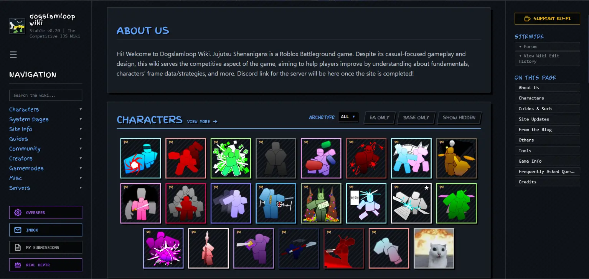
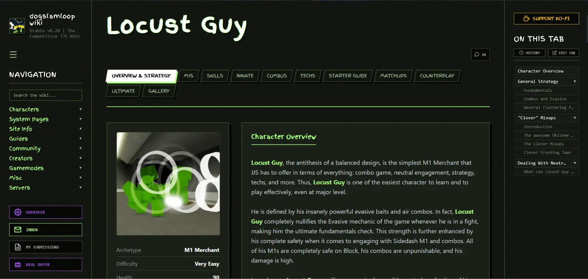

# Dogslamloop Wiki

An awesome open-source competitive wiki made for Jujutsu Shenanigans

---

## About

**Welcome** to [Dogslamloop Wiki](https://dogslamloop.com/), a custom-made
wiki built for the Roblox fighting game Jujutsu Shenanigans (JJS).

Here you'll find the frame data of moves in JJS, strategies, matchups,
counterplay, tier lists, discussions and more. As you can probably tell, it is
heavily inspired by [Dustloop Wiki](https://www.dustloop.com/w/Main_Page). The
site is run by me (Deptr) and a small staff team, who help review edits and
moderate the site.

---

## How Do I Use the Wiki?

You can read everything here for free, with no need to sign up. You can even
play around with the Editor as much as you like. To submit edits or take part
in discussions, you need to sign in first, either with an email and password
or quickly through Discord, Google or GitHub.

If you're thinking of editing the wiki, check out the
[Writing Guide](https://dogslamloop.com/systems/writing_guide/index.html)
first. It covers everything you need to know about the tools and the rules to
follow.

---

## No Framework, No Nothing?

Yes. The site is built with static HTML, CSS and JavaScript, with Supabase for
the database and GitHub Pages for hosting. To set up your own copy of
Dogslamloop Wiki on your device, see [CONTRIBUTING.md](CONTRIBUTING.md).

---

## AI Transparency

AI assistants helped build this project, mostly with the code: implementing
features and fixing bugs. Google's Gemini was used until August 2026, and
Anthropic's Claude since then. Claude also drafts the Site Update Log and
checks the wording of the policy pages. I make all the creative decisions and
design choices.

NO AI-GENERATED MEDIA IS USED: no AI-generated images, videos or art, and no
AI-generated wiki pages. They are strictly forbidden here.

---

## Contributions

See [CONTRIBUTING.md](CONTRIBUTING.md).

---

## Community

Join the official [Discord server](https://discord.gg/FR2DeR6c5h) to be part
of the Dogslamloop Wiki community. Or simply take part in the discussions on
the wiki, in the [Forum](https://dogslamloop.com/forum.html) or the character
threads. Either way, follow the
[Terms of Service](https://dogslamloop.com/terms.html) and the
[Forum Rules](https://dogslamloop.com/systems/forum-rules/index.html).

You can report bugs, make suggestions or share feedback in the
#bugs-feedback-suggestions channel on the Discord server.

---

## Credits

Major credits to all the awesome people on the
[Collaborators page](https://dogslamloop.com/systems/collaborators/index.html),
to every editor who has contributed to the wiki, and to
[Dustloop Wiki](https://www.dustloop.com/w/Main_Page) for the inspiration.

---

## Licence

- The code is under the [MIT License](LICENSE).
- The content is under [CC BY-NC-SA 4.0](CONTENT-LICENSE.md).

---

## Affiliation

This wiki is fan-made and not affiliated with, or run by, Tze's Shenanigans or
Roblox.
